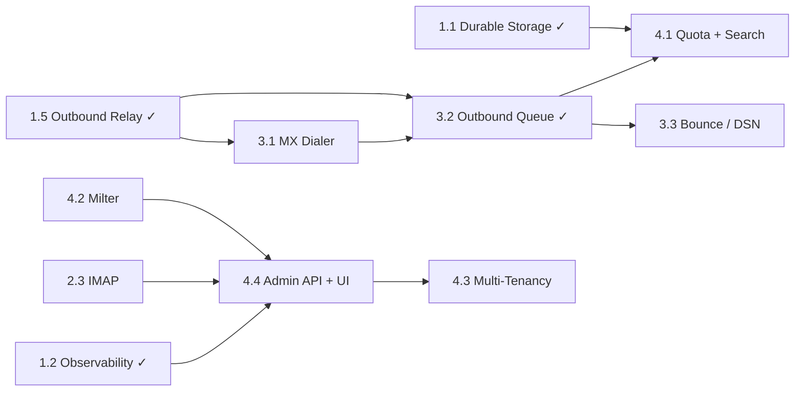

# Postbox Engineering Roadmap

This roadmap tracks planned work across four phases, ordered from foundational correctness to advanced scale and enterprise features. Items within a phase are largely parallelizable but the phases themselves have a rough dependency order.

T-shirt sizes: S (<1d), M (1–2d), L (3–5d), XL (1–2w)

---

## Phase 1 — Production Foundation ✓

### ~~Epic 1.1 · Durable Storage Backends~~ ✓ SHIPPED
Wire real mailbox backends (PostgreSQL, MongoDB) into `cmd/serve.go` instead of the in-memory default. `--mailbox-backend` (memory|postgres|mongo) and `--mailbox-dsn` flags wired. Factory in `internal/mbxstore`. Postgres/Mongo backends unlock everything that requires persistence across restarts.

### ~~Epic 1.2 · Observability: OpenTelemetry + gRPC Health~~ ✓ SHIPPED
`/metrics` served via OpenTelemetry with a Prometheus bridge (`internal/observability`). `grpc.health.v1` registered via `google.golang.org/grpc/health`. Configurable via `--metrics-port` and `--health-enabled`.

### ~~Epic 1.3 · DNSBL / RBL Check at Connect Time~~ ✓ SHIPPED
`DNSBLPlugin` (`internal/plugin/dnsbl.go`) queries one or more DNS block-lists during message processing. Per-IP results cached with configurable TTL. Wired into the plugin chain and `cmd/serve.go`.

### ~~Epic 1.4 · Persistent Redis IP Lockout~~ ✓ SHIPPED
`SMTPSecurityPlugin` now supports a Redis-backed lockout store (`--smtp-security-redis-lockout`). Falls back to in-memory when Redis is absent. Lockouts survive restarts and are shared across cluster nodes.

### ~~Epic 1.5 · Outbound Relay via SendGrid / SMTP~~ ✓ SHIPPED
Outbound delivery layer implemented in `internal/relay`:

- `SMTPBackend` — plain SMTP with TLS and SASL (AWS SES, Mailgun, Postfix, any SMTP relay)
- `SendGridBackend` — HTTP to SendGrid v3 API with API key auth
- `DKIMSigningBackend` — wraps the SMTP backend; signs messages before delivery
- Wired via `OutboundConfig` in `cmd/config.go` with `--outbound-*` flags

---

## Phase 2 — Complete Inbound Compliance

### ~~Epic 2.1 · DMARC Enforcement~~ ✓ SHIPPED
`EmailAuthPlugin` extended with DMARC alignment check. `DMARCPolicy` field added alongside `SPFPolicy` / `DKIMPolicy`. Wired via `--email-auth-dmarc-policy`.

### Epic 2.2 · Implicit TLS (Port 465) + Autocert (L)
Add `tls_mode: implicit` to `SMTPConfig` — wraps the listener with `tls.NewListener` rather than STARTTLS upgrade. Optionally wire `golang.org/x/crypto/acme/autocert` for automatic Let's Encrypt certificates when a public hostname is configured.

### Epic 2.3 · IMAP Server (XL)
Implement an IMAP4rev1 (RFC 3501) server using `github.com/emersion/go-imap` or a similar library. Exposes mailbox store contents as IMAP mailboxes. Required for standard MUA clients (Thunderbird, Apple Mail, Outlook).

### Epic 2.4 · OAuth2 / OIDC Authentication (L)
Add SASL OAUTHBEARER and XOAUTH2 SMTP AUTH mechanisms. Validate tokens against a configured OIDC provider (Keycloak, Auth0, Google Workspace). Required for modern mail clients that no longer accept password auth.

---

## Phase 3 — Outbound Delivery

### Epic 3.1 · MX Lookup + Direct Delivery Dialer (L)
Implement a direct-delivery dialer: DNS MX lookup → SMTP connection with STARTTLS → delivery with optional retry. Basis for not requiring an external relay for outbound mail.

### ~~Epic 3.2 · Outbound Queue~~ ✓ SHIPPED (in-memory)
In-memory delivery queue with exponential-backoff retry and dead-letter handling after max attempts. Implemented in `internal/relay/queue.go`. Workers drain on shutdown; ctx cancelled only after drain timeout. Wired via `--outbound-queue` flag.

> Persistent queue backed by the node store (durable across restarts) is deferred to a future iteration.

### Epic 3.3 · Bounce / DSN Generation (M)
Generate RFC 3464 Delivery Status Notifications for permanent and transient failures. Return bounces to the envelope sender via the outbound queue.

### ~~Epic 3.4 · Outbound DKIM Signing~~ ✓ SHIPPED
Messages signed with a configured DKIM private key using `go-msgauth/dkim` via `DKIMSigningBackend`. Signing uses pre-built wire bytes to avoid header reordering that would invalidate the signature. PTR validation is deferred.

---

## Phase 4 — Enterprise and Scale

### Epic 4.1 · Quota, Retention, and Full-Text Search (L)
Per-mailbox storage quotas enforced at `Data()` time. Configurable message retention with background expiry. Full-text search on subject/body backed by the storage layer (PostgreSQL tsvector, MongoDB Atlas Search).

### Epic 4.2 · Milter Protocol (XL)
Implement an RFC 6647 Milter client so arbitrary third-party milter daemons (SpamAssassin milter, ClamAV milter, custom policy milters) can be plugged in without writing Go code. Runs as a plugin in the existing chain.

### Epic 4.3 · Multi-Tenancy (XL)
Namespace all data by tenant ID. Tenant-scoped plugin configurations, rate limits, and storage quotas. Admin-level gRPC/REST API to provision and deprovision tenants.

### Epic 4.4 · Admin REST API + Web UI (L)
REST API wrapping the gRPC server for easier integration and scripting. Minimal web UI for message search, plugin configuration, queue inspection, and per-IP lockout management.

---

## Dependency Graph

---

## Out of Scope (Deliberate)

- Webmail UI (use an existing client like Roundcube against the IMAP server)
- Mailing list management (use Mailman or Listmonk)
- Built-in spam training corpus (integrate SpamAssassin or rspamd via the spam checker plugin)
